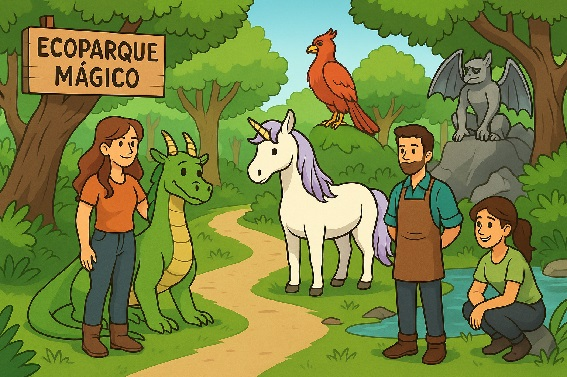

****

**Ecoparque Mágico 🐲🧜🦄**

**Primera parte: Habitantes y trabajadores**

Desarrollar y probar un programa que permita gestionar el Ecoparque Mágico. En él tendremos varias criaturas de las que nos interesa saber su edad y si son diurnas o nocturnas. Además, un trabajador puede **cuidar a un habitante** del Ecoparque Mágico. Un habitante puede ser cuidado si el trabajador **cumple con los requisitos especiales** de la criatura y además **se encuentra en su horario de trabajo**. Los habitantes pueden ser entrenados, lo que dependerá de cada uno en particular. Cuidar a una criatura consiste en alimentarla y luego entrenarla. Por último, se quiere saber si las criaturas son jóvenes o no.

**Habitantes posibles:**

* **Dragón**:  
  Tiene 90 años, es una criatura diurna y tiene también una temperatura corporal de 200°C. Necesita un cuidador que soporte altas temperaturas. Cuando se lo alimenta, su temperatura corporal aumenta en 20°. Entrena escupiendo fuego mientras vuela, por lo que cuando lo hace su temperatura se reduce 40°. El dragón no puede ser entrenado si su temperatura corporal es 100°C o menos. Cuando duerme, su temperatura corporal vuelve a 200°C. Se considera joven a un dragón si su edad es menor a 100 años.

* **Unicornio**:  
  Tiene 30 años y, además, tiene un poder mágico de 3 unidades y queremos saber si está feliz. Es una criatura diurna y no tiene ninguna condición extra para ser cuidado. Cuando se lo alimenta, su poder mágico aumenta en 1 unidad. Para ser entrenado necesita que su poder mágico sea mayor a 5, y cuando lo hace se pone feliz. Si se duerme y estaba feliz, deja de estar feliz, pero si duerme cuando no está feliz, pasa a estar feliz. Se considera joven a un unicornio si tiene menos de 50 años.

* **Sirena**:  
  Tiene 60 años y tiene una habilidad acuática de 40\. Es una criatura nocturna y además el cuidador debe saber nadar. Cuando se la alimenta, su habilidad acuática aumenta en un 50%. La sirena además puede nadar una distancia (en metros) y practicar para la batalla. Al nadar, su habilidad acuática se reduce en 1 unidad por cada metro recorrido. Al practicar para la batalla, su habilidad acuática se reduce en 20 unidades. Cuando entrena, la sirena nada una cantidad de metros igual a la mitad de su habilidad acuática y además practica para la batalla. En este caso, puede practicar para la batalla o nadar, aunque la habilidad acuática sea menor a la necesitada, pero nunca puede ser menor que 0\. En caso de que sea 0, no puede nadar ni practicar. Si duerme, su habilidad acuática vuelve a ser 40\. Se considera joven a una sirena si tiene menos de 45 años.

* **Fénix**:  
  Tiene 180 años y nos interesa saber su energía. Su energía es igual a su edad si su pelaje está reluciente, pero si no lo está se reduce a la mitad. Además, también queremos saber si el fénix es un pichón. Esto ocurre cuando su edad es menor a 5 años. Es una criatura tanto diurna como nocturna, por lo que se puede atender a cualquier horario. Requiere un trabajador que soporte altas temperaturas y tenga más de 5 años de experiencia para su cuidado. Cuando es alimentado pueden pasar dos cosas: si es un pichón, su edad aumenta en 1 unidad. Si ya no es pichón, su plumaje se vuelve reluciente. Solo puede entrenar si no es un pichón. Si duerme su plumaje deja de estar reluciente, aunque no haya entrenado. Ahora bien, si duerme cuando tiene más de 200 años, el fénix termina su ciclo de vida y vuelve a ser un pichón, volviendo su edad a 1\. Se considera joven a un fénix cuando tiene menos de 150 años.

* **Gárgola**:  
  Tiene 15 años y tiene dos estados: puede estar en forma de estatua o en forma viva, pudiendo cambiar esto cuando quiera. Es una criatura nocturna y solo puede ser cuidado si está en forma viva. Esta criatura no puede ser alimentada, por lo que si se quiere hacer esto no va a tener ningún efecto. Al entrenar, su edad disminuye en 1 unidad y vuelve a su estado de estatua. Como esta criatura descansa de día y el sol la daña, su edad aumenta 5 unidades cuando duerme. Siempre se la considera joven.

**Trabajadores posibles:**

Los trabajadores deben poder **cuidar de un animal**. Esto consiste en alimentarlo y entrenarlo. Para ello, primero se debe comprobar si el trabajador puede cuidar de ese animal.

* **Rodrigo**:  
  Es un trabajador del turno de la mañana y es nuevo en el área. Tiene un tutor, que es otro trabajador de la empresa, quien lo acompaña en las tareas de cuidado. Sabe nadar pero todavía no se anima a meterse solo, por lo que solo va a hacerlo solo si su tutor sabe nadar. No tiene resistencia a altas temperaturas. Rodrigo, como es el nuevo, a veces debe cubrir el turno de la noche, por lo que su horario puede cambiar. No tiene años de experiencia (0).

* **Laura**:  
  Trabaja a la noche siempre. Tiene resistencia a altas temperaturas y no sabe nadar. Tiene 2 años de experiencia. Como es la que mejor se lleva con la gárgola, cuando la ve cambia instantáneamente al modo vivo, por lo que ella siempre puede entrenarla.

* **Germán**:  
  Trabaja a la mañana y es el que más experiencia tiene (15 años). Sabe nadar y tiene resistencia a altas temperaturas. Germán puede enseñar a un trabajador una habilidad, lo que hace que ahora ese trabajador pueda nadar o resistir a altas temperaturas según corresponda.

* **Jimena**:   
  También trabaja a la noche. Sabe nadar, y no tiene resistencia a altas temperaturas, pero puede llevar un traje ignífugo. Si tiene el traje puesto, puede resistir altas temperaturas, aunque ella no tenga la resistencia. Tiene 8 años de experiencia. 

**Tests:**

Realizar tests donde se prueben diversas situaciones, como por ejemplo:

* Que **Laura** puede cuidar al **Dragon**.

* Que **Rodrigo** no puede cuidar a la **Gárgola**. Probar también que puede cuidarla si **cambia de turno**.

* Que **Germán** puede cuidar al **Fénix,** pero no al **Dragon**.

* Que **Jimena** puede cuidar a la **Sirena**.

---

**Segunda parte: Gestión del Ecoparque**

Ahora el Ecoparque Mágico funciona como una empresa que tiene un **equipo de trabajadores** en el que se encuentran **Germán, Laura y Jimena**. Además, el ecoparque ya cuenta con las 5 criaturas mágicas en su parque.

Se necesita implementar las siguientes funcionalidades:

* **Contratar a un trabajador**.

* **Despedir a un trabajador**.

* **Despedir a todos los trabajadores**.

* **Contratar a varios trabajadores a la vez**.

* **Saber si el equipo de trabajadores es grande** (si tiene más de tres trabajadores).

* **Saber si el ecoparque necesita trabajadores.** Se consideran que necesita trabajadores si no tiene ninguno contratado.

**Tests:**

Realizar al menos un test por cada función anterior para verificar su correcto funcionamiento.

---

**Tercera parte: Ecoparque recargado**

Aparecen **nuevos requerimientos** en el Ecoparque:

Se necesita:

* **Averiguar si un habitante puede ser cuidado por el Ecoparque** (es decir, si al menos un trabajador puede hacerlo).

* **Obtener todos los trabajadores que pueden cuidar un habitante dado**.

* **Determinar cuántos animales del ecoparque son viejos** (o sea, no son jóvenes).

* **Cuidar de un habitante elegido:** esto consiste en indicar qué habitante se quiere cuidar y se buscará un trabajador que pueda cuidarlo. 

* **Cuidar de todos los animales.** Esto implica que todos los animales sean cuidados por alguno de los trabajadores del ecoparque.

* **Pasar el día,** que consiste en hacer que todos los animales sean cuidados y además que todos duerman una vez. 

* **Encontrar el habitante más viejo y el más joven** (en cantidad de años).

* **Realizar taller de natación.** Si al menos la mitad de los trabajadores sabe nadar, hacer que todos los trabajadores aprendan a nadar.

* **Realizar taller de resistencia al fuego.** Si al menos un trabajador tiene más de 10 años de experiencia, hacer que todos los trabajadores aprendan a resistir al fuego.

**Tests:**

* Realizar al menos un test para cada nueva funcionalidad que demuestre su correcto funcionamiento.

**Bonus:**

* **Agregar un nuevo trabajador**.

* **Agregar un nuevo habitante mágico**.

Verificar que todo el sistema funcione correctamente tras estas incorporaciones.
